CMPE272 Assignment 2
=======
# Assignment 2 : Building Serverless Application
## Author : Pratikkumar Dalsukhbhai Korat
### SJSU ID : 017512508

* This project utilizes the Amazon Web Services to build serverless application which perform the CRUD operations on DynamoDB

## Technologies Used in this Application
> 1. Amazon Web Services
> 2. Python (for Lambda Function)
> 3. AWS Dynamodb

## Steps

### Step 1 : Setting up Dynamo Database
> 1. Go to AWS management console and open Dynamodb and Create a table named "StudentRecords".
> 2. Mention the primary key as "student_id" and it should be string.
> 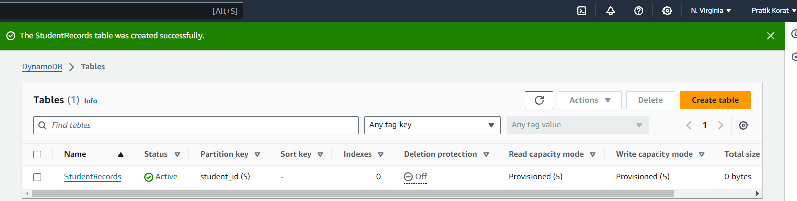

### Step 2 : Setting up IAM role
> 1. Go to Identity Access Management and Create a user role which has full access to DynamoDB
> 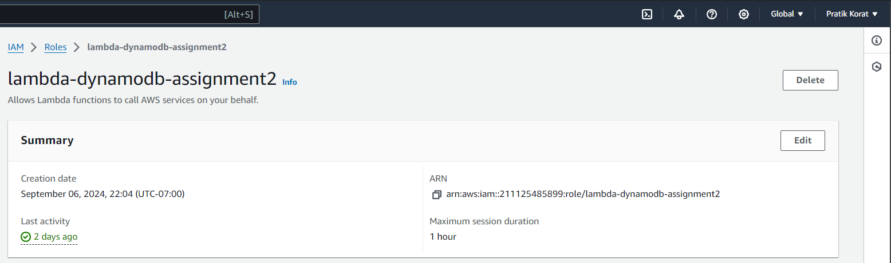
> 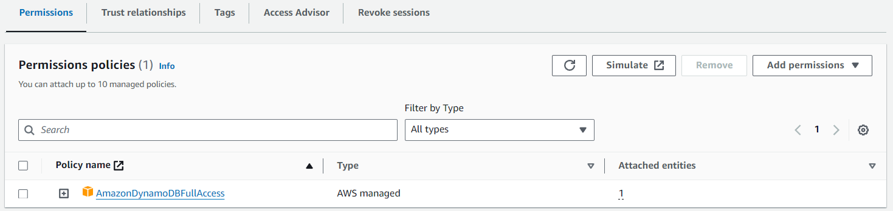

### Step 3 : Setting up Lambda Function
> 1. Go to AWS Lambda console and create a new function and give a name StudentRecordHandler
> 2. Chose appropriate runtime, in this project, I am going to utilize Python 3.9 Runtime
> 
> 3. Attach the appropriate user role to allow read and write of DynamoDB.
> 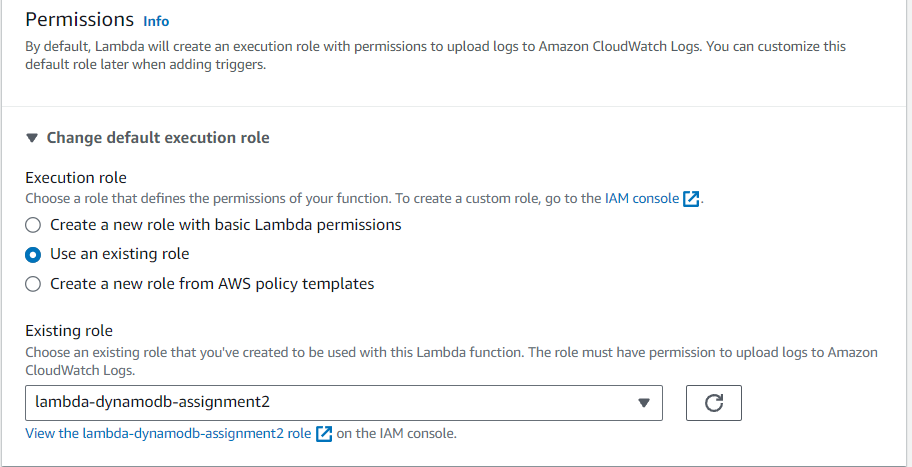
>
> 4. Copy and Paste code written in lambda.py to lambda function
> 5. Click on Deploy
> 6. Configure the Test Event for basic testing
>    1. test_post event
>       * Paste the following JSON to test configuration window
>         * ```{"method": "POST", "body": "{\"student_id\": \"11\", \"name\": \"Pratik Korat\", \"course\": \"Computer Science\"}"}```
>       * Result
>       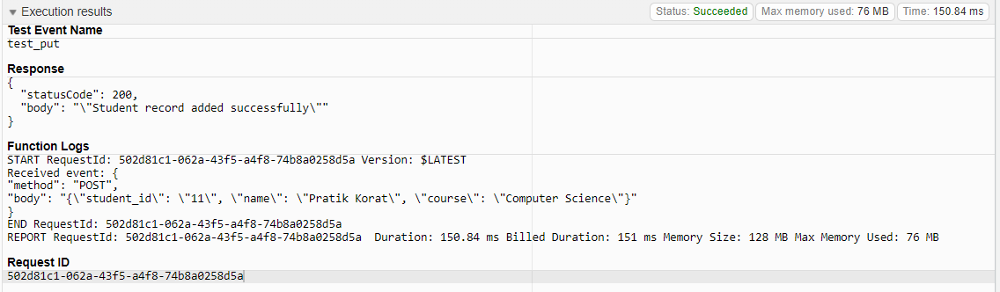
>    2. test_get event
>       * Paste the following JSON to test configuration window
>         *  ``` { "method": "GET", "query": { "student_id": "1"}} ```
>       * Result
>       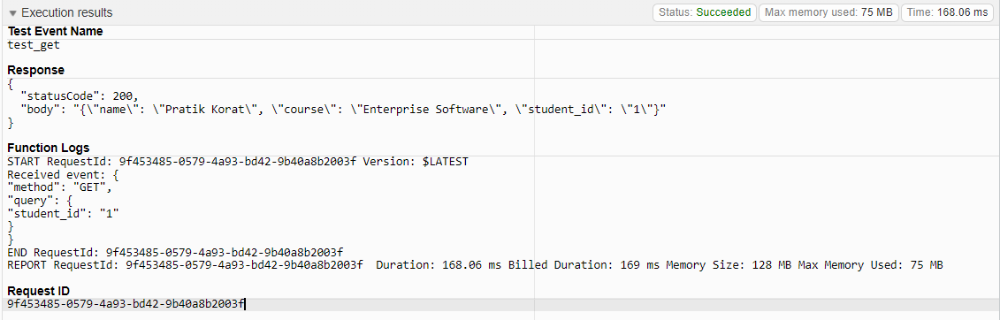
>    3. test_delete event
>       * Paste the following JSON to test configuration window
>         *  ``` {"method": "DELETE", "query": {"student_id": "11"}} ```
>       * Result
>       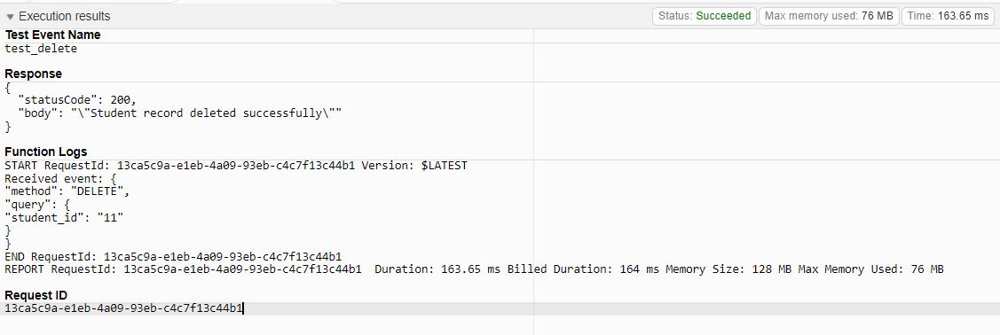
>    4. test_update event
>       * Paste the following JSON to test configuration window
>         *  ``` {"method": "PUT", "body": "{\"student_id\": \"1\", \"name\": \"Pratik Updated\", \"course\": \"Data Science\"}"} ```
>       * Result
>       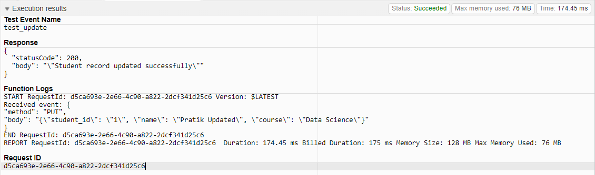


### Step 4: Create an API Gateway
> 1. Go to AWS API Gateway control and click on Build for REST API.
>   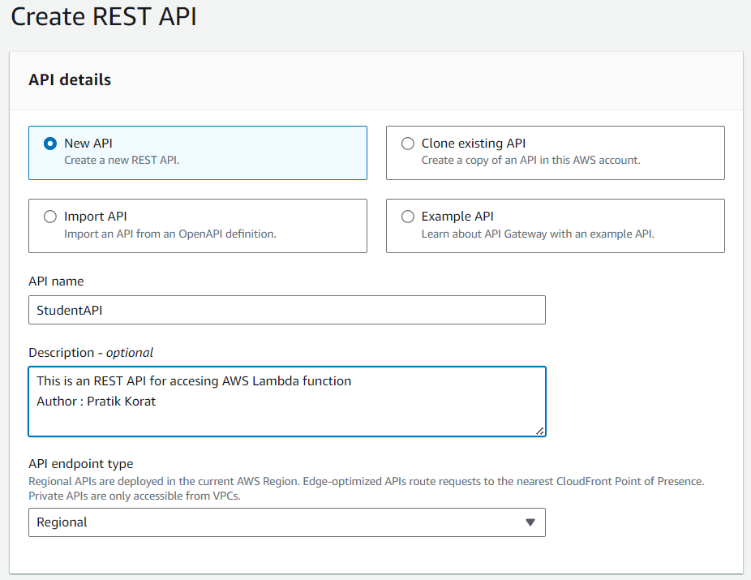
> 2. Create resource and name it "students"
> 3. Under resource student, Create a GET method
>    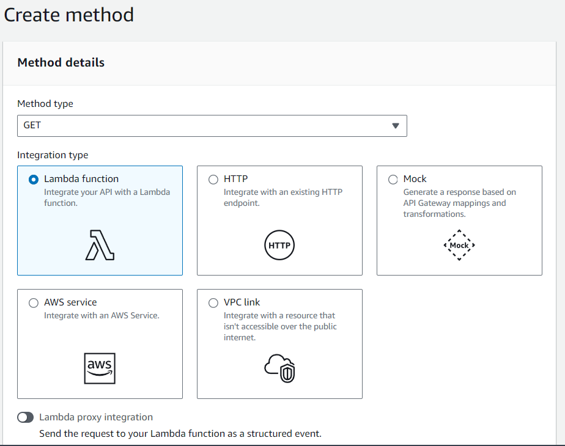
>    1. Once GET method is created, then go to integration request, then go to mapping template, then click on edit and paste the content of "integration_template", then click on save.
>    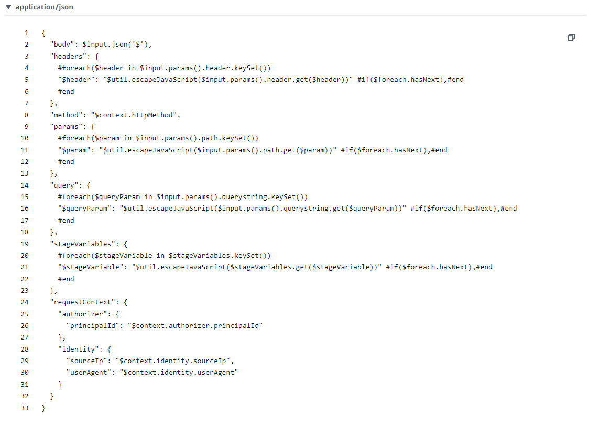
>    2. Make sure it should look like this as shown in above picture.
> 4. Under resource student, Create a POST method
>    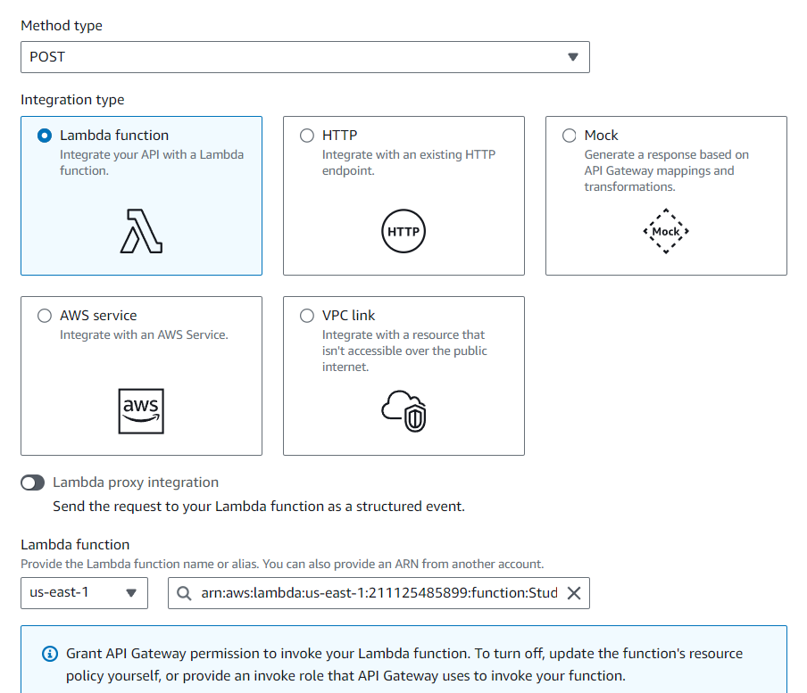
>    1. Once POST method is created, then go to integration template, then go to mapping template, then click on edit and paste the content of "integration_template", then click on save.
>    
>    2. Make sure it should look like this as shown in above picture.
> 5. Click on deploy API, chose appropriate deploy version


### Results
> 1. GET request
>    * POSTMAN
>      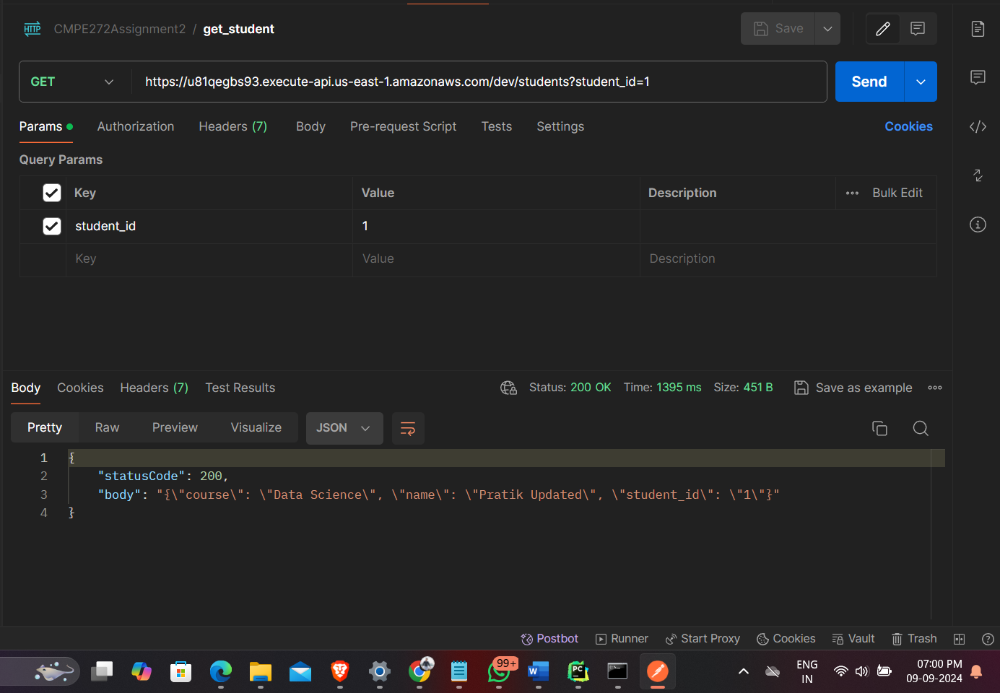
>    * AWS DynamoDB
>      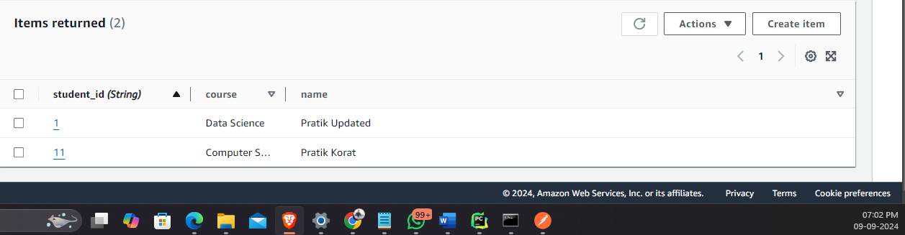
>

> 2. POST request
>    * POSTMAN
>       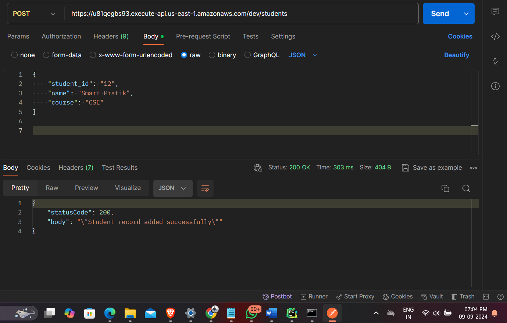
>    * AWS DynamoDB
>       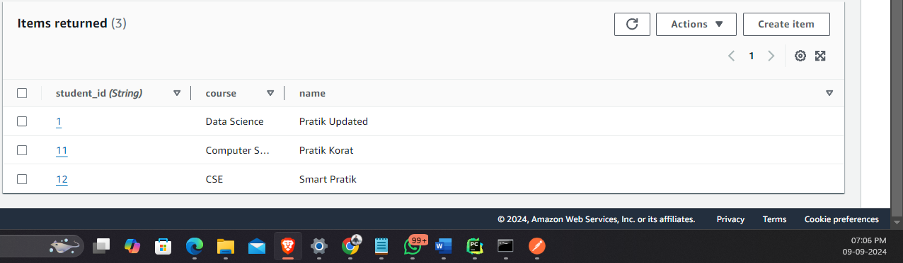


* Currently, this application supports both READ and WRITE operations on DynamoDB via a Lambda function through a REST API.

## Issues Faced
* During the development of this project, I encountered an issue with integrating a REST API with a Lambda function, specifically in parsing the request body in the Lambda function. To resolve this, I created a custom mapping template capable of handling both GET and POST requests.